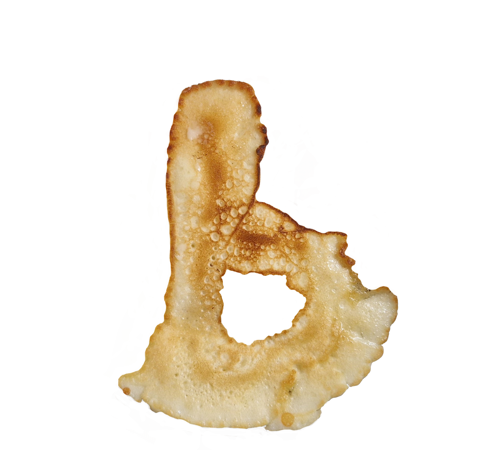

# P for Pancake

The idea of turning a pancake into a bespoke character came at the moment when all great ideas are born: during breakfast - or, more accurately, before it. Breakfast is usually like a no for me, but I needed something easy to make and simple enough to document step by step. Henceforth, what you’re seeing here.

Looking at it reminded me of this [vid](https://www.youtube.com/watch?v=Rp-DutiXg7Q)

### Here's the step by step meanwhile

