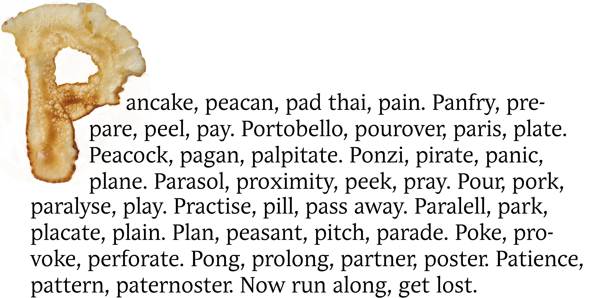
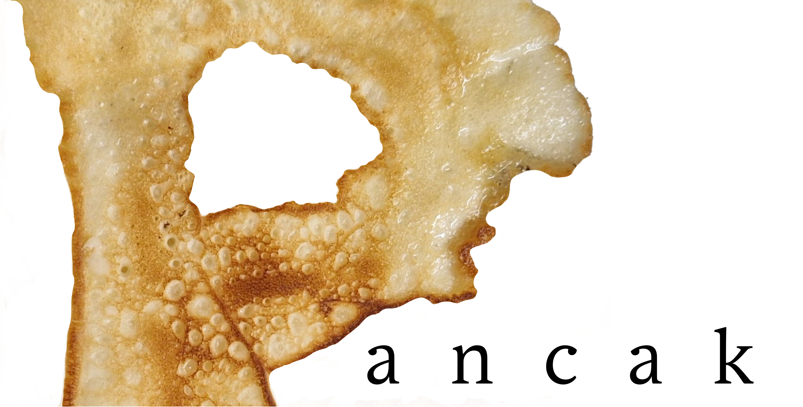

# One image says a couple of words

There's not much to yap about, here's the result:

At first, it was meant to be just a wall of words starting with *p*, but the first six, when I read them [in my head](https://www.youtube.com/watch?v=49tyOkJ0uLs&list=RD49tyOkJ0uLs&start_radio=1), sounded a bit like a poem but written by an amateur and a dumbass. Hey, hi, hello lol

I know the first image was meant as like a header image in alt-text channel, but the second one was nicer :3

You know what you see, no comments here.
