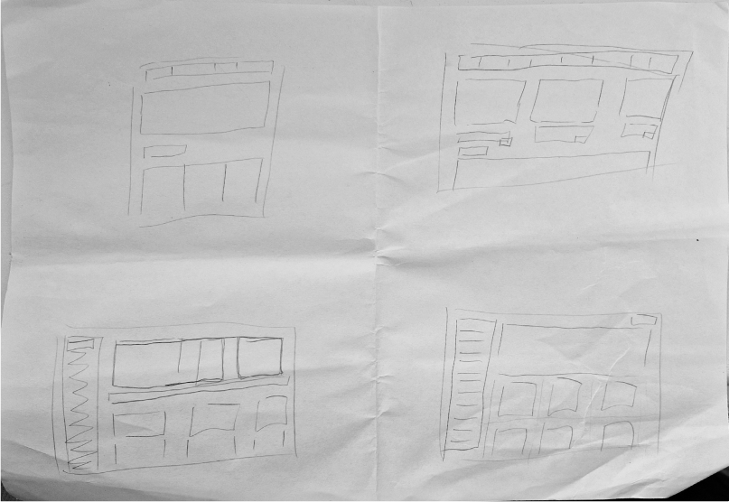
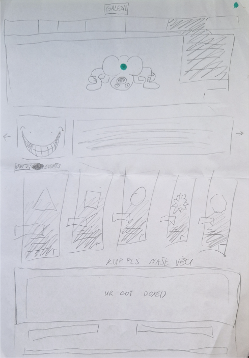
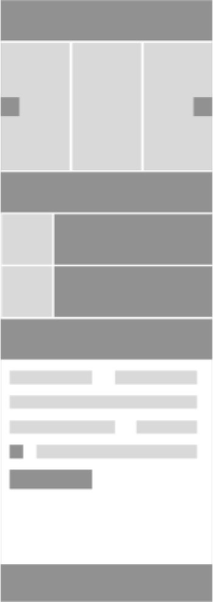
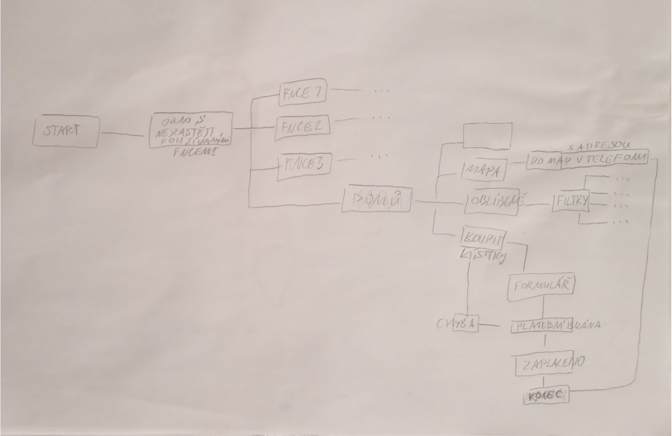
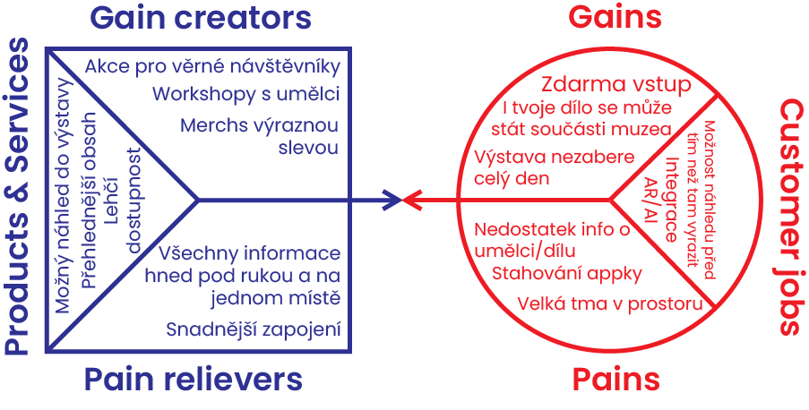
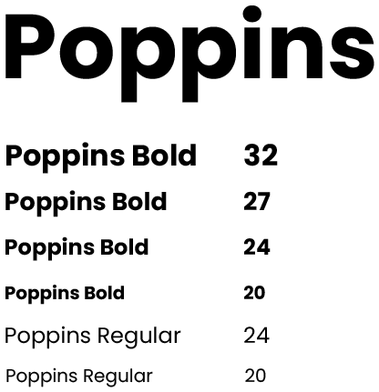
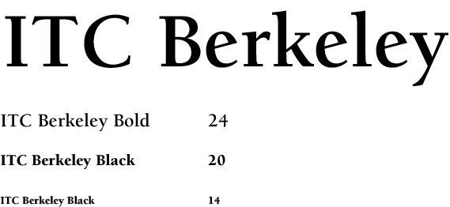

# Case study: Museum Of Bad Art

## Museum of bad art?

Museum Of Bad Art (MOBA) is world's only museum that celebrates art and their artists, that would not be accepted into any other traditional museums. With over 700 paintings, they currently have two permanent galleries. One in Boston, Massachusetts and the other in Quebec, Canada. They are a non-profit museum, yet their admission always remains free. (You can buy merch on their site or donate tho). MOBA has this cheeky style of language that made me just fall in love with their premise.

## Why creating this?

It began as a project for my graphic design course. Our task was to design a small website prototype, that later expanded into creating an app.

I started by looking for a gallery/museum that could benefit from a little refresh and that would be fun to do. The search wasn't long, as i stumbled across a video talking about the museum. The art there looked kinda funny. Wonky, bizarre and the right amount of shitty. It was perfect for a project!

Starting point was by looking at MOBA's website. I believe you can come to your own conclusions. While there could be an argument that it's on theme, a little polish never hurt anyone.

[MOBA Website](https://museumofbadart.org)

## How does one design a website?

At the beginning, I didn’t know the answer either. Never was a website creating girlie, don’t feel like one still… The important thing was, through research and a lot of youtube tutorials later, I came to a couple of conclusions:

1)	The site could really benefit from rhetorical facelift
2)	Navigation wasn’t the best
3)	Besides the logo it looks like any other site made on wordpress

Here's some pictures

After I found a direction to go in. I started the wireframe and choosing what fonts and colours phase. 

With wireframe, I left it mostly as it was. I chose to make it a long scroll page where you don’t have to click on each different section, only to find out it has a couple of sentences written.

The main red colour, I took from their logo. It’s a bold and energetic colour that would certainly differentiate it from any other art museum site with more ‘respectable’ palette.

![A picture with 2 big squares. One is bright red (#E80000) with the text inside it translating into: Main colour. The other is cream white (#FFFDF9) with the text inside it translating into: Background, with two smaller squares under the bigger one's. The colours of the squares go as: pink (#FF7F7F), darker red (#920000), pure white (#FFFFFF) and black (#000000). The text under them translate into: Buttons on/off and Texts. Beside all of those squares are two names of the fonts: Poppins and ITC Berkley](img/site-color-palette-and-typography.png)

Font Poppins was chosen as a main font, to make the website feel less old. But in combination with ITC Berkley, I hoped to make the transition less jarring. 

With all of this combined, you can take a peek at the final result with this [Figma link to the website prototype](https://www.figma.com/design/huh5sY326v7DI0s5Xr6prU/Microsite?node-id=0-1&t=JFOLbT2PinTIFQE8-1)

## New asigment, same museum

There was a choice between, continuing the previous project or starting a new one. I lied about it being a decision, cuz I chose the former one in a heartbeat.

Despite staying with the same topic, there was a whole new can of worms to open. From understanding visitors wants and museums needs to flowcharts and making more wireframes.

Tired? [Here's a short link for a small prototype that you can play with](https://www.figma.com/design/5qie7gq2lvfrvaeRjyzC8A/MOBA-App?node-id=0-1&t=d1ozd9fbRnLvk5Ll-1)
