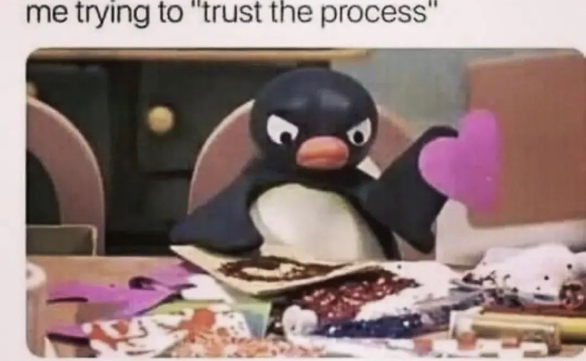
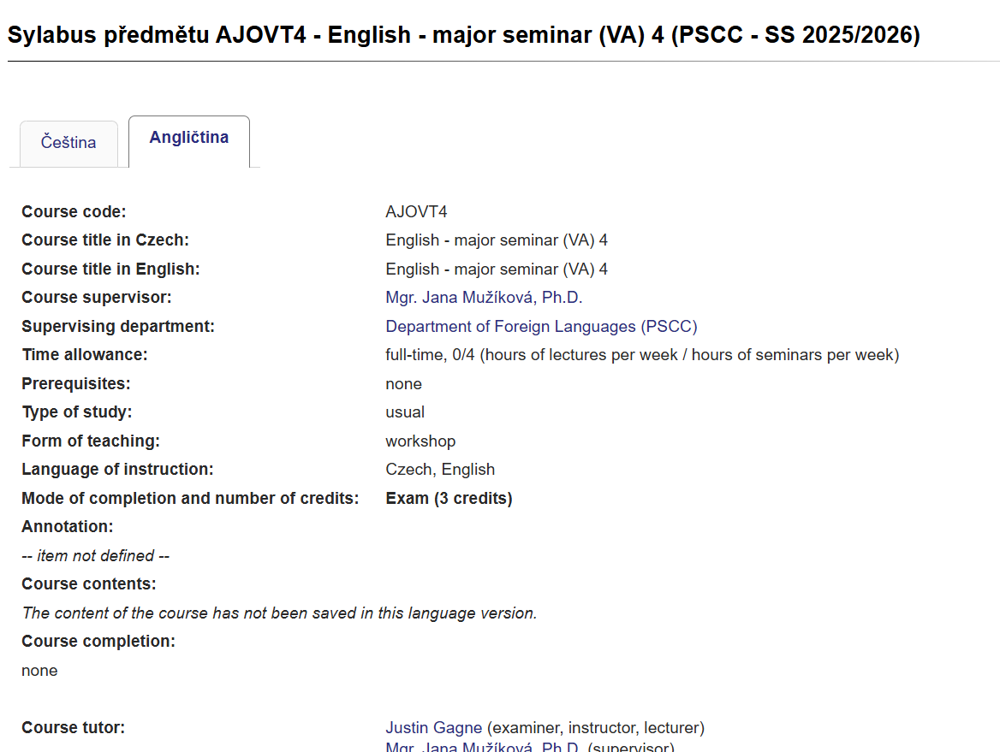
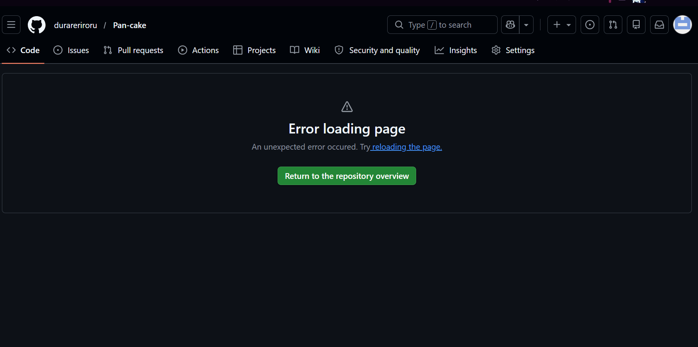
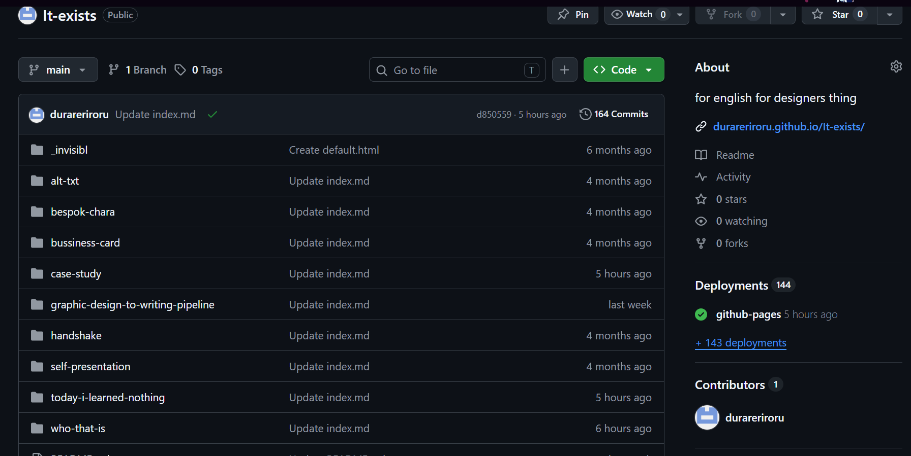

# Trust the process, worry about the results later

Creating is hard. Don’t let anyone fool you into thinking you’re not doing enough. 

Yet here I am with a presentation, and you are sitting there, counting away the minutes when I finally stop yapping and we can go home. Me too. (For any readers out there, you can stop here :) No one’s holding you hostage. Thanks for checking this out tho, ur a real g. Now byeee)

I’m not a writing kind of girlie and I’ll never be one. Same with anything that has to do with tech stuff (unless it’s involving the destruction of said tech, ref. my laptop). 
So imagine joining this class, yeah? 

It’s all in English, no problem. 

There’s going to be a slack group, okey. 

You gotta create a git? hub acc?
Who’s that? Never heard of her. 

I follow the in-person tutorial in class but holy shit, slow down! I didn’t catch that and what do you write there or why is this not working, fuckkkk. After more swearing in my head and frantic looks from the projector to my classmates to my phone and back again, the lesson ends and I have no idea on how to continue. 

So, starts the one-sided fight between me and this new language. 

I search on how to replicate the stuff I saw but it’s all either not what I’m going for or it’s too long don’t wanna read. It was super frustrating, so I left it be. Sometimes, I found that just leaving things alone, for whatever amount of time, and then coming back to it later made the whole process feel, maybe not faster but a lot smoother. 

I started small. Created a bunch of new files and filled them with even more files named img and index.md. inside the img file I created another file named o or a or aaaooaaaaa since without it I can never find the add file button. After adding all the jpegs, pngs or whatevers, I needed to write code?
With some snooping around my classmates’ repos and finally asking Justin,

it clicked.

Suddenly, the page loads images instead of showing broken links and their mid descriptions. There's text that I wrote, re wrote then deleted and wrote again. Oh, the joy was back! Adding meaningless links to videos only I will ever enjoy and writing in those brain dead references into picture descriptions.

Creating this page was fun once I understood what to finally do and type in it. Can’t say it’s super creative or groundbreaking but the crowd goes mild and that’s enough for me. 

It-exists and it-was-worth-it.
