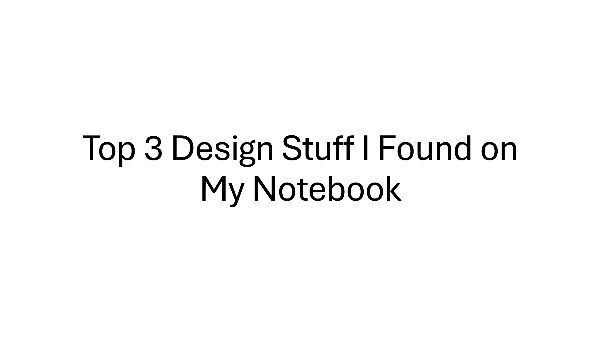
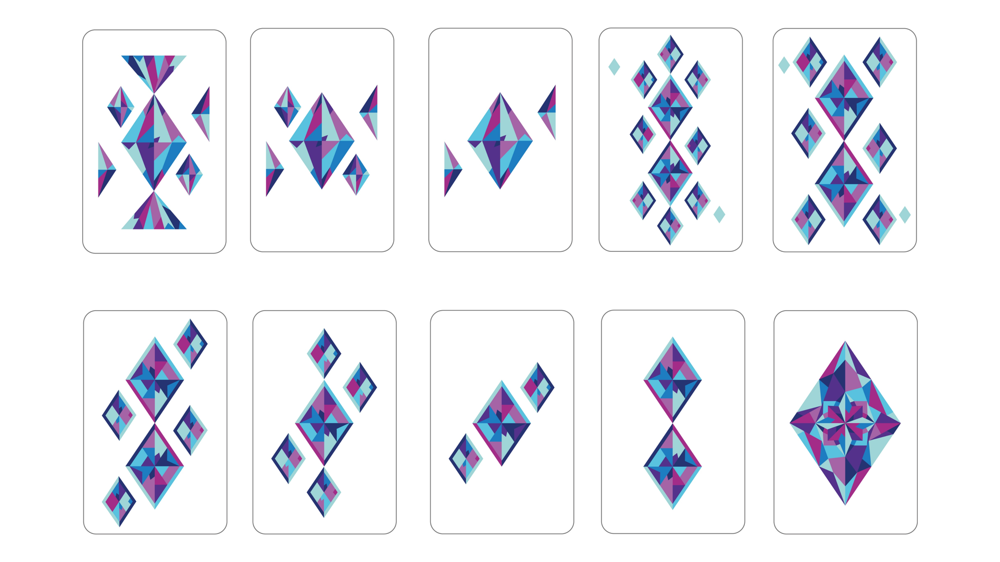
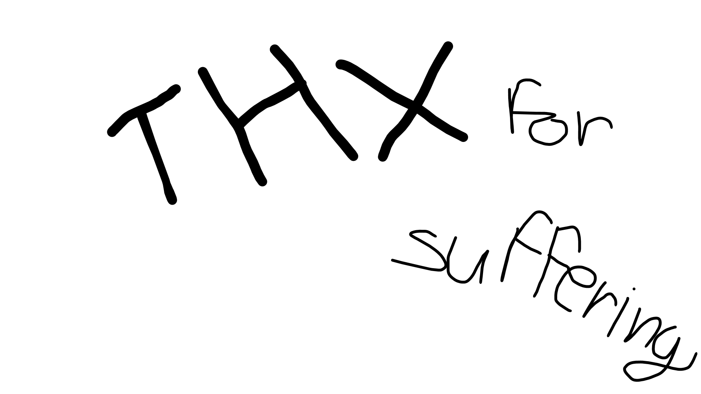

# Presentation: the short ~~and sweet~~

![The third slide shows a poster of a custom-made alphabet. The font is designed to resemble human hands, severed just below the wrist, with the letters formed by bending the fingers into mostly unnatural angles. The hands are arranged on a checker-patterned background, like pieces on a chessboard—except for the letters M and N, which sit in the corners of the third row. At the centre is the name of the font, UNCLEAR GESTURES. One alternative name considered was Fear Garden, inspired by the song sharing the same name.](img/presebtace-3.png)
![The third slide shows a Japanese character for spring (春, haru), made to resemble a cherry blossom tree that blooms during the season, painted with watercolours. The character is written in dark brown to mimic a tree trunk from which pink leaves, shaped like clouds, sprout from the top of the tree, leaning to the right. The whole composition is set in a void, shifting from pink at the top to light blue at the bottom gradient background. There were 3 more drawings in the series, but they were lost in the dusts of my room.](img/presebtace-4.png)

