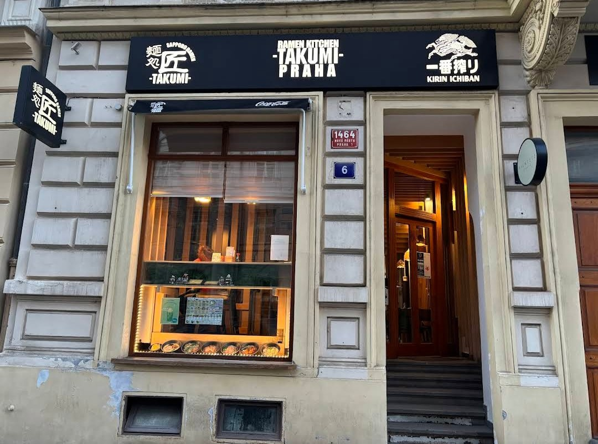
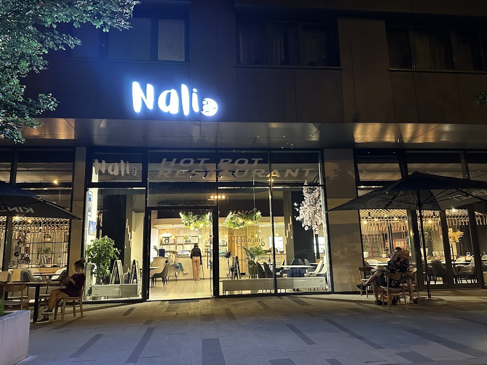
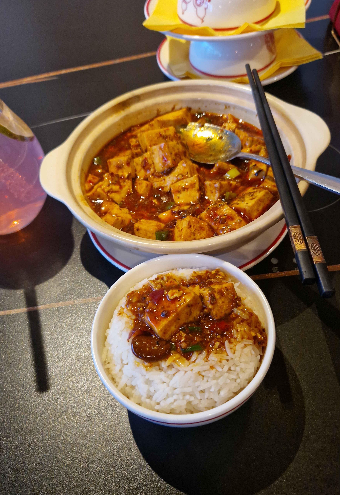

# Shittiest ramen in Prague

It's Kung-fu ramen on havelská street in old town

here are better places

[Isai Ramen](https://www.google.com/maps/place/Isai+Ramen/@50.0889598,14.3412477,17z/data=!3m1!4b1!4m6!3m5!1s0x470b95d51071a9e9:0xd41d8f6ecea97288!8m2!3d50.0889598!4d14.3438226!16s%2Fg%2F11h79shlql?entry=ttu&g_ep=EgoyMDI2MDUwNi4wIKXMDSoASAFQAw%3D%3D)

[TAKUMI PRAHA](https://www.google.com/maps/place/TAKUMI+PRAHA/@50.0859944,14.4284767,17z/data=!3m1!4b1!4m6!3m5!1s0x470b95fc2b2d868b:0x1f7265d799aa5d64!8m2!3d50.0859944!4d14.4310516!16s%2Fg%2F11h4k6km_2?entry=ttu&g_ep=EgoyMDI2MDUwNi4wIKXMDSoASAFQAw%3D%3D)

[Any of the BON Fresh Ramen & Soba places](https://www.google.com/maps/search/bon+fresh+ramen+and+soba/@50.0859925,14.410452,14z/data=!3m1!4b1?entry=ttu&g_ep=EgoyMDI2MDUwNi4wIKXMDSoASAFQAw%3D%3D)

They serve [chinese](https://www.youtube.com/watch?v=q4bPMxeCnos) there instead but you have a lotta options to choose from, especially if you like spicy food.

[Nali 小院里 Hotpot Restaurant](https://www.google.com/maps/place/Nali+小院里+Hotpot+Restaurant/@50.0832679,14.4636782,17z/data=!3m1!4b1!4m6!3m5!1s0x470b93e9b2d59cb7:0x11eabe21a7e415cb!8m2!3d50.0832679!4d14.4662531!16s%2Fg%2F11kpj8wkqg?entry=ttu&g_ep=EgoyMDI2MDUwNi4wIKXMDSoASAFQAw%3D%3D)

I bring you here, a little proof. This mid pic of mapo tofu from that place.

